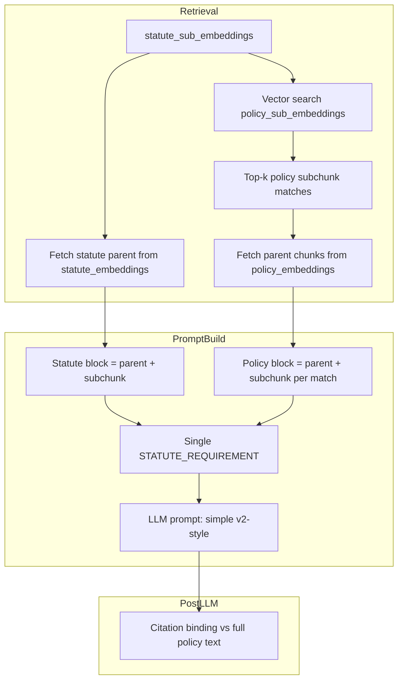

# Refactor v3 Gap Analysis to v1 Subchunks with Full Context

## Summary

Switch from v2 (chunk-level: statute_embeddings, policy_embeddings) to v1 (subchunk-level: statute_sub_embeddings, policy_sub_embeddings). The key constraint: **subchunks are passed with full context (parent + subchunk combined) as self-contained blocks**—no confusing "use subchunk for X, chunk for Y" instructions, and **no full policy document** appended to the prompt.

## Data Flow

## Implementation Plan

### 1. Add policy_sub_embeddings_vector_index to config

[compliance_config.py](compliance_config.py) — Add `policy_sub_embeddings_vector_index` (design doc specifies `policy_sub_embeddings_vector_index` for the subchunk collection). Default: `policy_sub_embeddings_vector_index`. The existing `retrieve_policy_subchunks_for_statute_subchunks` uses `vector_index_name`; v3 retriever will need the subchunk-specific index.

### 2. Refactor VectorRetriever.retrieve_statute_policy_pairs_v3

[vector_retriever.py](vector_retriever.py) (lines 551–657):

- **Collections:** Switch from `statute_embeddings_collection` / `policy_embeddings_collection` to `statute_sub_embeddings_collection` / `policy_sub_embeddings_collection`.
- **Index:** Use `policy_sub_embeddings_vector_index` (or fallback to `vector_index_name`).
- **Text fields:** Use `statute_subchunk_text_field` and `policy_subchunk_text_field` for subchunk text.
- **Parent context retrieval (v1 design):**
  - After vector search returns policy subchunk matches, collect `parent_chunk_id` from each match.
  - Query `policy_embeddings` for those IDs to get parent chunk text.
  - For statute subchunks, collect `parent_chunk_id` and query `statute_embeddings` for parent text.
- **StatutePolicyPairV3 extension:** Add optional `statute_parent_context: str` and `policy_parent_contexts: List[str]` (or embed in a richer PolicyMatch) so the service can build context-rich blocks.

**Alternative:** Extend `PolicyMatch` to include `parent_context: Optional[str]` and add `statute_parent_context: str` to `StatutePolicyPairV3`.

### 3. Update gap_analysis_service_v3

[gap_analysis_service_v3.py](gap_analysis_service_v3.py):

- **Policy indexed check:** Change `_policy_indexed` to query `policy_sub_embeddings_collection` instead of `policy_embeddings_collection` (design: v1 checks `policy_sub_embeddings`).
- **Build context-rich blocks for LLM:**
  - **Statute block:** `statute_parent_context + "\n\n" + statute_subchunk` (or vice versa per design). Single combined string.
  - **Policy block:** For each policy match, `parent_context + "\n\n" + subchunk_text`; concatenate all with separators (e.g. `\n\n---\n\n`).
- **LLM call:** Pass these combined blocks to `gap_check_v3` as `statute_chunk_text` and `policy_chunk_text`—no subchunk/chunk labels.
- **Citation binding:** Unchanged—validate `policy_quote` against full policy text from `policies` collection.

### 4. LLM prompt (no changes to YAML structure)

[prompts/gap_analysis_v3.yaml](prompts/gap_analysis_v3.yaml) — Keep the current v2-style prompt with placeholders `STATUTE_CHUNK` and `POLICY_CHUNK`. The service will populate them with the **context-rich combined blocks** (parent + subchunk). No new placeholders, no subchunk/chunk terminology.

### 5. Config: policy_sub_embeddings_vector_index

- Add to `ComplianceConfig` dataclass and `DEFAULT_CONFIG`.
- Add to `load_config()`.
- Ensure `retrieve_statute_policy_pairs_v3` uses it when querying `policy_sub_embeddings`.

### 6. Update OpenAPI and Swagger

[routes.py](routes.py) — Update the v3 gap-analysis endpoint description from "Uses statute_embeddings and policy_embeddings" to "Uses statute_sub_embeddings and policy_sub_embeddings (v1 design). Subchunks include parent context; no full policy text in prompt."

Regenerate or update [openapi.json](openapi.json) per AGENTS.md.

## Key Design Decisions

| Aspect           | Decision                                                                                                    |
| ---------------- | ----------------------------------------------------------------------------------------------------------- |
| LLM prompt       | Same v2-style: `STATUTE REQUIREMENT:` and `POLICY TEXT:` with combined blocks. No subchunk/chunk labels.    |
| Full policy text | Not in prompt. Used only for citation binding validation post-LLM.                                          |
| Context          | Statute = parent + subchunk. Policy = for each match, parent + subchunk; all concatenated.                  |
| Collections      | statute_sub_embeddings, policy_sub_embeddings, plus statute_embeddings/policy_embeddings for parent lookup. |

## Files to Modify

1. [compliance_config.py](compliance_config.py) — Add `policy_sub_embeddings_vector_index`
2. [vector_retriever.py](vector_retriever.py) — Refactor `retrieve_statute_policy_pairs_v3` to subchunk collections + parent context
3. [gap_analysis_service_v3.py](gap_analysis_service_v3.py) — Policy indexed check, context-rich block building, LLM args
4. [routes.py](routes.py) — OpenAPI description
5. [openapi.json](openapi.json) — Per AGENTS.md
