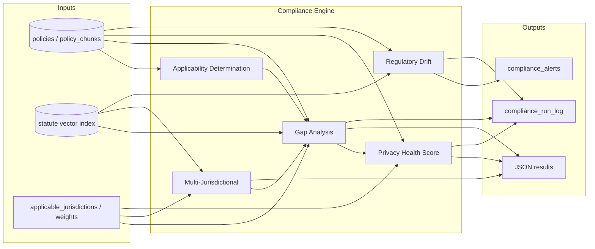

# Backend Design: Automated Compliance Analysis Suite

Design the backend functionality (routes, services, storage, vector search, and SLM integration) required to implement the Automated Compliance Analysis Suite on top of the existing Privacy Audit Studio codebase, aligning with the functional spec's four engines (Gap Analysis, Multi-Jurisdictional, Health Score, Regulatory Drift) and recommended features.

---

## Current state (from codebase)

- **App**: Flask; entry point [app.py](../app.py). Blueprints: `db`, `core`, `util`, `routes`, `compliance` (no URL prefix).
- **Compliance today**: Single endpoint `POST /policy-statute-compliance` in [compliance_routes.py](../compliance_routes.py). [ComplianceService](../compliance_service.py) loads policy (by id or inline text), segments via [PolicySegmenter](../segmenter.py), retrieves statute candidates with [VectorRetriever](../vector_retriever.py) (MongoDB `$vectorSearch` by jurisdiction), compares via [AnthropicLLMClient](../llm_client.py), evaluates with [ComplianceEvaluator](../compliance_evaluator.py), audits via [AuditLogger](../audit_logger.py).
- **Vector**: [VectorRetriever](../vector_retriever.py) already supports vector search with metadata filter (jurisdiction, statute_corpus_id) against statute or embeddings collection. Core [GET /search](../core.py) is per-document only (document_id + query).
- **Config**: [ComplianceConfig](../compliance_config.py) + [policy_compliance_config.json](../policy_compliance_config.json) drive database, collection names, and field names (e.g. `statutes_collection`, `statute_text_field`, `statute_jurisdiction_field`). No `privacy-compliance` DB or `policy_chunks`/`statute_chunks` names in code; design will stay config-driven so spec schema (document_id, chunk_header_text, chunk_text) can be mapped via config.
- **DB usage**: Generic [db.py](../db.py) (write_to_collection, documents, etc.). Audit uses config `audit_collection` in the same database as the request.

---

## 1. Configuration and schema alignment

**Goal:** One configurable compliance DB and collection set so the spec's `privacy-compliance` + `policies`/`statutes`/`policy_chunks`/`statute_chunks` and the current schema both work.

- **Add to [ComplianceConfig](../compliance_config.py) (or new `ComplianceSuiteConfig`):**
  - `compliance_database` (e.g. `privacy-compliance`) for all new collections.
  - Policy source: `policies_collection`, `policy_chunks_collection` (optional). If policy has `policy_chunks` and config points to it, use chunks; else use full `text` (current behavior).
  - Statute chunks: already have `statutes_collection` and field names; add optional `statute_chunk_header_field` (e.g. `chunk_header_text`) and ensure `document_id` is available (already have statute_id_field / section_id).
  - New collections: `compliance_results_collection`, `compliance_alerts_collection`, `compliance_run_log_collection`.
  - Index versioning: `statute_index_version_field` (e.g. `indexed_at`) or a separate `compliance_index_versions` collection keyed by (index_name, updated_at) for drift.
- **Config file / env:** Jurisdiction list default, score weights (e.g. conflict_penalty_multiplier, requirement_weights), and optional canonical requirement IDs for multi-jurisdictional in [policy_compliance_config.json](../policy_compliance_config.json) or a dedicated `compliance_suite_config.json`.

**Schema mapping:** Policy document may have `text` or `policy_chunks` (array of `chunk_text`, `chunk_header_text`, `document_id`). Statute chunks: use existing config (`statute_text_field` → chunk text, add optional header field). No code change to existing statute schema required if current fields already carry chunk text and jurisdiction.

---

## 2. Vector search for compliance engines

**Gap Analysis and Multi-Jurisdictional** need statute chunks by jurisdiction and by "disclosure requirement" semantics (e.g. "right to know", "right to delete", "sale of data", "sensitive data").

- **Reuse and extend [VectorRetriever](../vector_retriever.py):**
  - Current: `retrieve(database, section_text, jurisdiction, statute_corpus_id, top_k)` — one query, one jurisdiction.
  - Add (or implement in a new service that uses the same pipeline):
    - **Option A:** `retrieve_by_queries(database, jurisdiction, queries: List[str], top_k_per_query: int)` that runs `$vectorSearch` per query (same filter by jurisdiction), deduplicates by chunk id, returns list of statute chunks with `document_id`, `chunk_text`, `chunk_header_text`, jurisdiction, score. This supports "per category" retrieval in the spec.
  - Keep using existing embedding model and index name from config; ensure statute collection (or embeddings collection) has jurisdiction in the filter.
- **No new public "vector search" endpoint required** if all callers go through the compliance services. If a generic "search statute index by query + jurisdiction" is needed for other clients, add a thin `POST /api/compliance/vector-search` that calls this retrieval and returns top-k chunks (and document_id); same pipeline as above.

**Policy-side retrieval:** For "statute–policy citation extraction" (spec 6.2), if policy is chunked and indexed, add a similar retrieval that searches policy chunks by query (or by statute chunk similarity). That can be a separate small method in the same or a new "policy retriever" used only by the compliance suite.

---

## 3. New API surface and route layout

**Base path:** Mount compliance suite under `/api/compliance/` so the spec's "routes under `/api/compliance/`" is satisfied. Two options:

- **Option A (recommended):** Register the existing `compliance_bp` with `url_prefix='/api/compliance'`. Then existing endpoint becomes `POST /api/compliance/policy-statute-compliance`. Add new routes on the same blueprint.
- **Option B:** Keep current compliance blueprint at root; create a second blueprint `compliance_suite_bp` with `url_prefix='/api/compliance'` for the new endpoints only.

**New endpoints (all POST, JSON body, JSON response):**

| Endpoint | Purpose | Key request body | Key response |
|----------|----------|-------------------|--------------|
| `POST /api/compliance/applicability` | Jurisdiction inference (spec 6.1) | `policy_document_id` or `text`; optional `database`, `policy_collection` | `applicable_jurisdictions`, optional `confidence` per jurisdiction |
| `POST /api/compliance/gap-analysis` | Compare policy to Golden Standard (spec 2) | `policy_document_id` (or company + selection); optional `applicable_jurisdictions[]`, `num_rows` (partial run) | `gaps[]`, `summary` (total/missing/addressed/conflicts), `analyzed_at` |
| `POST /api/compliance/multi-jurisdictional` | Strictest common denominator (spec 3) | `applicable_jurisdictions[]`; optional `policy_document_id` | `strictest_common_denominator[]`, `conflicts_between_jurisdictions[]` |
| `POST /api/compliance/health-score` | Privacy Health Score 0–100 (spec 4) | `policy_document_id`; optional `applicable_jurisdictions[]`, `weights` | `privacy_health_score`, `score_breakdown`, `components`, `analyzed_at` |
| `POST /api/compliance/drift-check` | Regulatory drift alerts (spec 5) | optional `since`, `policy_document_ids[]` | List of alert payloads and/or stored in `compliance_alerts` |

**Request/response shapes:** Define Pydantic models in a new module (e.g. `compliance_schemas.py` or extend [schemas.py](../schemas.py)) for each request/response so validation and OpenAPI stay consistent. Use the exact JSON shapes from the spec for responses (e.g. gap status `missing|addressed|conflict`, health score breakdown by_jurisdiction / by_category).

**Auth:** Reuse [security.authorize_request](../security.py) and config `auth_required` / `allowed_roles` from existing compliance routes for all new endpoints.

---

## 4. Service layer (orchestration and reuse)

**Placement:** New logic in a dedicated service module (e.g. `compliance_suite_service.py`) that uses existing components and new helpers. Avoid duplicating policy load and retrieval logic.

**Dependencies to inject (same as today where applicable):**  
`mongo_client`, config, embedder, `VectorRetriever`, LLM client, rate limiter, audit logger. Add: **storage helper** for compliance_results / compliance_alerts / compliance_run_log (see section 6).

**Applicability (6.1):**
- Input: policy_document_id (or inline text) + optional database/policy_collection.
- Load policy text (reuse same policy-load pattern as [ComplianceService._load_policy](../compliance_service.py): by id from collection or use inline text).
- Single SLM call with strict prompt: "List US state codes (e.g. CA, VA) and 'US federal' for which this privacy policy is likely intended." Structured output: `{ "applicable_jurisdictions": ["CA","VA",...], "confidence": { "CA": 0.95, ... } }`. Parse and validate; on parse failure retry once with "output only valid JSON".
- Return applicability JSON. No storage required for this endpoint alone.

**Gap Analysis (2.x):**
- Resolve jurisdictions: use request `applicable_jurisdictions` if provided; else call applicability (or default to config "all indexed jurisdictions").
- Load policy: by `policy_document_id` (and optional company selection) — full text or policy_chunks from DB; reuse existing policy-load pattern and config for collection names.
- Per jurisdiction: retrieve statute chunks using disclosure-style queries (fixed list per category, e.g. "right to know", "right to delete", "sale of data", "sensitive data") via extended VectorRetriever (multiple queries, top-k per query, dedupe).
- Per (statute_chunk, policy): one SLM call with statute chunk + policy text (or relevant policy chunks). Prompt asks: (a) Is the required disclosure/obligation addressed? (b) If yes, quote policy phrase; if no, "MISSING". (c) Any conflict? Structured output: `addressed`, `policy_quote`, `missing`, `conflict`, `conflict_description`. Enforce schema; retry once on parse failure; else mark `analysis_failed: true`.
- **Citation binding:** If SLM returns "addressed" with a non-empty `policy_quote`, verify the quote is a substring of the actual policy text; if not, treat as unverified and do not count as addressed (map to missing or a separate "unverified" that is treated as missing for scoring).
- Aggregate and deduplicate by (statute_reference, requirement_summary). Build response: `gaps[]`, `summary` (total_requirements, missing, addressed, conflicts), `analyzed_at`. Optionally write to `compliance_results` and `compliance_run_log` (see section 6).

**Multi-Jurisdictional (3.x):**
- Input: `applicable_jurisdictions[]`; optional `policy_document_id`.
- Per jurisdiction: retrieve statute chunks (same disclosure-style queries as gap analysis); then SLM to extract normalized requirements: "List discrete privacy/consumer rights or obligations…" → structured list `{ "requirements": [ { "label", "description" } ] }`.
- Cross-jurisdiction: SLM (or deterministic label matching) maps each requirement to a canonical id (e.g. `right_to_delete`, `right_to_know`, `opt_out_of_sale`). Config or prompt provides the canonical set.
- Strictness: For each canonical requirement, SLM compares formulations and returns `strictest_jurisdiction`, `strictest_description`, `other_jurisdictions` with descriptions. On tie, allow array of strictest_jurisdictions.
- If policy_document_id provided: for each canonical requirement run the same "addressed/conflict" check as in gap analysis for each jurisdiction; then SLM: "Does the same policy language satisfy both A and B or conflict?" → `satisfies_all | satisfies_strictest_only | conflict_between_jurisdictions | not_provided`. On ambiguity set `policy_alignment: "unclear"`.
- Output: `strictest_common_denominator[]`, `conflicts_between_jurisdictions[]` as in spec. Optionally persist in `compliance_results` keyed by (policy_id, jurisdictions, timestamp).

**Health Score (4.x):**
- Reuse Gap Analysis: run gap analysis (or read last stored result if same policy + statute version) to get list of (jurisdiction, requirement, status: missing | addressed | conflict | analysis_failed).
- Base score: addressed=1.0, missing=0.0, conflict=0.0 (or configurable negative weight). analysis_failed excluded from denominator.
- Optional weights per requirement or category from config; default equal. Formula: weighted_sum / max_possible in [0,1]; if any conflict apply penalty (e.g. multiplier 0.7 or fixed deduction). Scale to 0–100, floor 0.
- Component breakdown: by_jurisdiction and by_category (e.g. rights, disclosures, retention) if requirement metadata or category is available from gap/multi-jurisdictional output.
- Edge cases: no applicable statutes → `privacy_health_score: null`, `error: "no_applicable_statutes"`; all analysis_failed → `error: "insufficient_analysis"`. Persist score and components in `compliance_results` and run_log.

**Drift (5.x):**
- Trigger: `POST /api/compliance/drift-check` with optional `since` (timestamp) and `policy_document_ids[]`.
- Drift detection: Determine "new or changed" statute chunks since last run. Use either: (1) stored `last_drift_check_at` and statute chunk collection's `indexed_at` (or equivalent) to find chunks with `indexed_at > last_drift_check_at`, or (2) stored set of statute chunk IDs from last run and diff against current index. From new/changed chunks derive `affected_jurisdictions[]`.
- Policy set: All policies in the policies collection, or policies whose (stored or inferred) applicable_jurisdictions intersect affected_jurisdictions, or the explicit `policy_document_ids[]` from the request.
- For each such policy: run full Gap Analysis (and optionally Health Score) with the **current full** statute set (not only new chunks). Fetch **last stored result** for that policy (from `compliance_results` keyed by policy_document_id, optionally statute_index_version).
- Diff: new_gaps (in current not in previous), resolved_gaps (in previous not in current), score_delta. Optionally tag which new statute chunk caused a new gap.
- For each policy with new_gaps or significant score drop: build alert payload (alert_id, type=regulatory_drift, policy_document_id, company_name, trigger, affected_jurisdictions, new_gaps, resolved_gaps, score_delta, previous_score, current_score, detected_at). Write to `compliance_alerts`. Update `last_drift_check_at` or stored statute set for next run.
- Idempotency / full re-baseline: If no previous result, store current run as baseline and do not emit drift alert. If statute index was rebuilt from scratch, support a "full re-baseline" parameter that clears stored baseline for all policies and does not emit spurious drift.

---

## 5. SLM and hallucination mitigation

- **Single LLM interface:** Use the same [LLMClient](../llm_client.py) abstraction (Anthropic today). Add new methods (or a dedicated "compliance SLM" wrapper) for: applicability, gap_check (statute chunk + policy → addressed/missing/conflict + quote), requirement_extraction, strictness_comparison, policy_alignment (multi-jurisdictional). All return structured JSON; prompts must require "output only valid JSON" and the exact schema.
- **Parsing and retry:** Parse JSON from LLM response (e.g. [extract_json_block](../compliance_utils.py)); validate against Pydantic schema. On failure retry once with reminder "output only valid JSON conforming to schema". If still invalid, set `analysis_failed: true` for that item and do not infer compliance.
- **Citation binding:** For any "addressed" with `policy_quote`, check that `policy_quote` is a substring of the actual policy text (normalize whitespace if needed). If not, treat as unverified and do not count as addressed.
- **Conservative mapping:** "Partially" or ambiguous → map to `missing`. Prefer false positives for gaps over false negatives.
- **Determinism:** Fixed prompts; stable ordering of statute chunks (e.g. sort by document_id, chunk_index); log statute chunk IDs and index version in run_log so runs are reproducible.

---

## 6. Storage and audit

- **Collections (in `compliance_database` from config):**
  - **compliance_results:** Store gap analysis and/or health score outputs. Document shape: `policy_document_id`, `company_name` (if available), `applicable_jurisdictions`, `statute_index_version` (or indexed_at/checksum), `gaps` (array), `summary`, `privacy_health_score` (if run), `score_breakdown`, `components`, `analyzed_at`, optional `run_id`. Index: (policy_document_id, statute_index_version) or (policy_document_id, analyzed_at) for "last result" lookup.
  - **compliance_alerts:** Alert records from drift. Fields: alert_id, type=regulatory_drift, policy_document_id, company_name, trigger, affected_jurisdictions, new_gaps, resolved_gaps, score_delta, previous_score, current_score, detected_at. Index: detected_at, policy_document_id.
  - **compliance_run_log:** Audit trail for every run. Fields: policy_document_id, statute_index_version, applicable_jurisdictions, run_timestamp, statute_chunk_ids_used (or hash), result_id (reference to compliance_results), optional input_hash. Enables "score over time" and reproducibility.
- **Writes:** From Gap Analysis and Health Score: write one compliance_results doc and one compliance_run_log doc per run. From Drift: write one compliance_alerts doc per affected policy. All in the same DB (configurable).
- **Existing audit:** Keep [AuditLogger](../audit_logger.py) for the existing policy-statute-compliance endpoint; new suite can also write to compliance_run_log for a unified trail.

---

## 7. Error handling and edge cases (cross-cutting)

- **Structured outputs:** All SLM responses validated; invalid → retry once → else analysis_failed.
- **Citation binding:** Only treat as addressed if policy_quote substring-matches policy text.
- **No human escalation:** Every path ends in machine action: store result, write alert, or explicit analysis_failed with reason.
- **Rate limiting:** Reuse existing [RateLimiter](../rate_limiter.py) for new endpoints; consider stricter limits for batch (drift-check).
- **Idempotency:** Same (policy_id, statute_index_version) produces same inputs to SLM; log chunk IDs and version so results are reproducible.

---

## 8. Implementation order and file map

| Step | Deliverable |
|------|-------------|
| 1 | Config: extend ComplianceConfig (or add ComplianceSuiteConfig) with compliance_database, new collection names, policy_chunks support, statute chunk header field, index version field, weights and canonical requirement IDs. |
| 2 | Vector: extend VectorRetriever with retrieve_by_queries (or equivalent) for multi-query per jurisdiction; ensure statute chunks return document_id, chunk_text, optional chunk_header. |
| 3 | Schemas: add Pydantic models for applicability, gap-analysis, multi-jurisdictional, health-score, drift-check requests and spec-compliant responses. |
| 4 | SLM: add prompts and LLM client methods for applicability, gap_check, requirement_extraction, strictness_comparison, policy_alignment; shared parse/retry and citation-binding helper. |
| 5 | Storage: small module (e.g. compliance_storage.py) to write/read compliance_results, compliance_alerts, compliance_run_log. |
| 6 | Service: compliance_suite_service.py implementing applicability, gap_analysis, multi_jurisdictional, health_score, drift_check (orchestrating retriever, LLM, storage, citation binding). |
| 7 | Routes: add POST handlers under /api/compliance/ for applicability, gap-analysis, multi-jurisdictional, health-score, drift-check; register blueprint with url_prefix='/api/compliance' (or add routes to existing compliance_bp with prefix). Auth and validation via existing patterns. |
| 8 | Drift: implement "new statute chunks since last run" (index version or indexed_at), affected jurisdictions, policy set selection, re-run gap/score, diff, alert write, baseline update. |

**Files to add:** `compliance_suite_service.py`, `compliance_storage.py`, `compliance_suite_schemas.py` (or extend schemas.py), and optionally `compliance_suite_prompts.py` or inline prompts in service. **Files to modify:** [compliance_config.py](../compliance_config.py), [vector_retriever.py](../vector_retriever.py), [llm_client.py](../llm_client.py) or a dedicated SLM wrapper, [app.py](../app.py) (blueprint registration), and a new or extended [compliance_routes.py](../compliance_routes.py) for the new endpoints.

---

## 9. Diagram: data and control flow

This design supports the four spec engines and the recommended additions (applicability, audit trail, optional citation extraction and scheduled pipelines) with zero human touch, reusing the existing vector retriever, LLM, and auth/config patterns.
